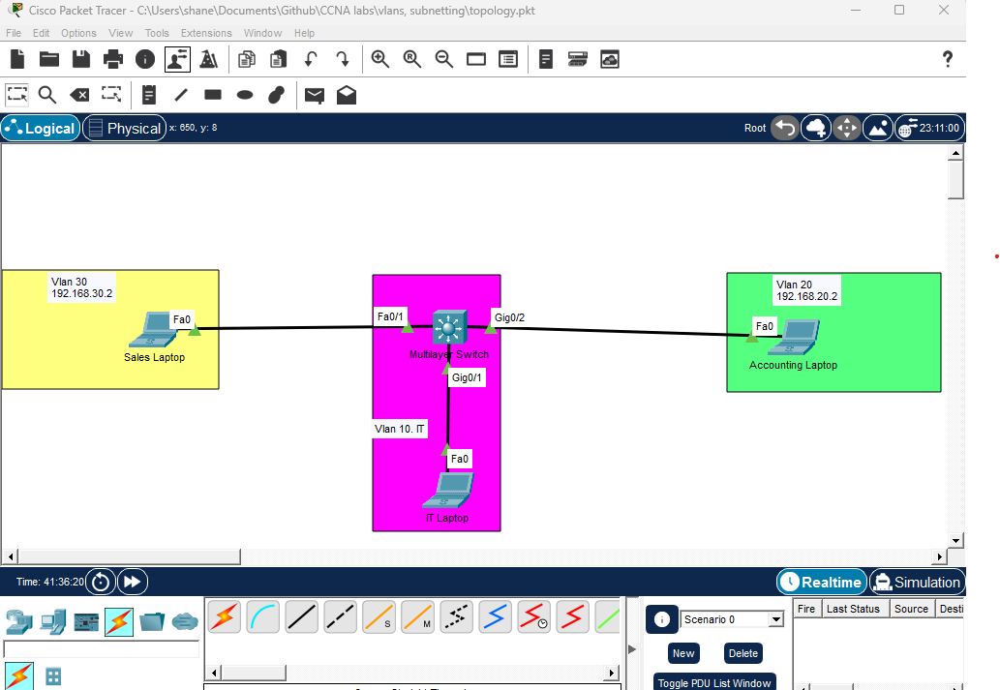
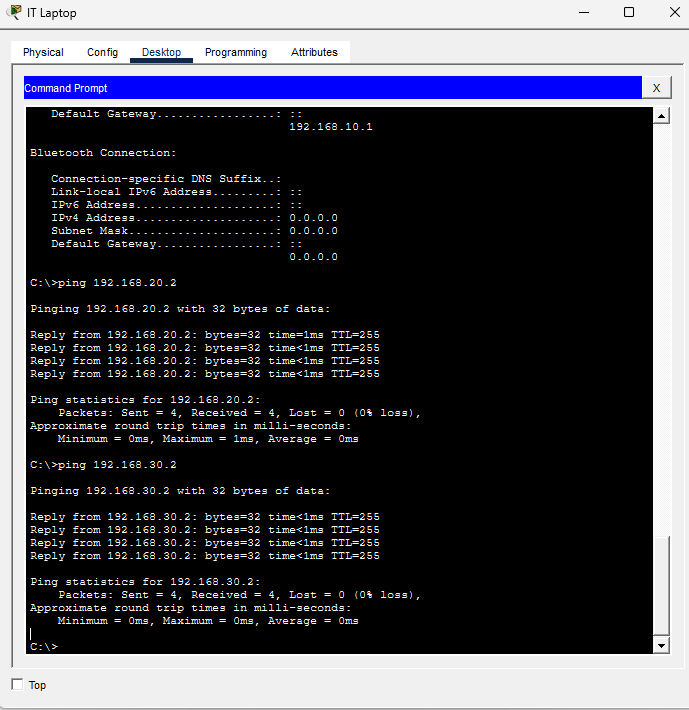

# Lab: Switching, VLANs, Subnetting & Inter-VLAN Routing

## Overview
This lab demonstrates core enterprise networking fundamentals including VLAN segmentation, IP subnetting, switch configuration, and inter-VLAN routing using Cisco IOS. The objective is to design, configure, and verify a secure and logically segmented network.

---

## Tools & Environment
- Cisco Packet Tracer
- Cisco IOS (Layer 2 & Layer 3 Switch)
- via laptop PC (SSH)

---

## Network Topology

**Topology Diagram:**  


**Devices Used:**
- 1 × Multilayer Switch
- 1 × End Device (IT Laptop)

---

## IP Addressing & Subnetting Plan

| VLAN | Name        | Network            | Gateway        |
|-----:|------------|--------------------|----------------|
| 10   | IT         | 192.168.10.0 /24   | 192.168.10.2   |
| 20   | Accounting | 192.168.20.0 /24   | 192.168.20.2   |
| 30   | Sales      | 192.168.30.0 /24   | 192.168.30.2  |

Subnetting was performed to logically separate broadcast domains and improve security and performance.

---

## Configuration Steps

### 1. VLAN Creation
```ios
vlan 10
 name IT
vlan 20
 name Accounting
vlan 30
 name Sales
exit
```
## 2. Enabling Routing (Layer 3)
```ios
ShaneSW1>en
Password: 
ShaneSW1#conf t
ShaneSW1(config)#ip routing
```
## 3. Mistakingly changing svi ip before loadshedding
```ios 
ShaneSW1(config)#int vlan 10
ShaneSW1(config-if)#ip add 192.168.10.1 255.255.255.0
% Connection refused by remote host
C:\>ssh -l ShaneSW 192.168.10.2

% Connection timed out; remote host not responding
C:\>ssh -l ShaneSW 192.168.10.2

Pinging 192.168.20.2 with 32 bytes of data:

Reply from 192.168.20.2: bytes=32 time=2ms TTL=255
Reply from 192.168.20.2: bytes=32 time<1ms TTL=255
Reply from 192.168.20.2: bytes=32 time<1ms TTL=255
Reply from 192.168.20.2: bytes=32 time<1ms TTL=255

Ping statistics for 192.168.20.2:
    Packets: Sent = 4, Received = 4, Lost = 0 (0% loss),
Approximate round trip times in milli-seconds:
    Minimum = 0ms, Maximum = 2ms, Average = 0ms

```
    
##  succesful inter Vlan pings



## Troubleshooting and Operational Issues.

- SSH Access Failure (SVI IP Mismatch)

- SSH and ping to 192.168.10.2 timed out

- Root cause: target IP belonged to IT PC, not switch

- Switch management SVI is 192.168.10.1 on VLAN 10

- Verified VLAN 10 SVI was administratively up (no shutdown)

- Corrected SSH target to SVI IP

- SSH access restored successfully
    

