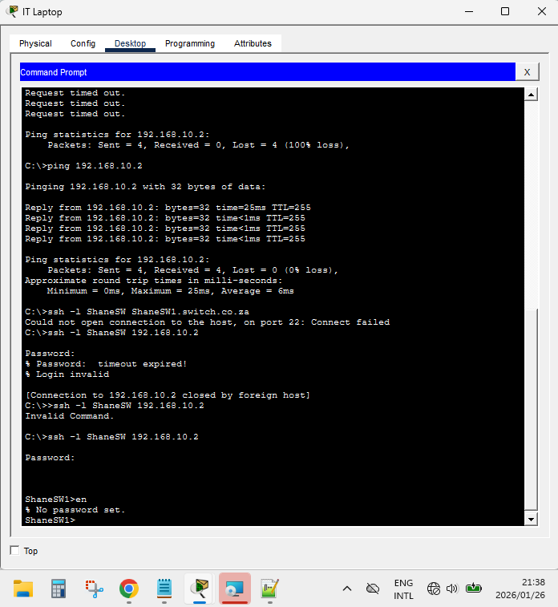

## Lab Name: Secure Remote Management (SSH)


**Date:** 2026-01-26
**Tools Used:** Cisco Packet Tracer


## 1.Objectives
- [x] **Task 1:** Configure a Switch Virtual Interface (SVI) for remote management.
- [x] **Task 2:** Generate RSA Cryptokeys (1024-bit) and enable SSHv2.
- [x] **Task 3:** Secure Virtual Teletype (VTY) lines with local authentication.
- [x] **Task 4:** Verify encrypted connectivity from the PC Command Line.


## 2.Topology map

A simple Peer-to-Peer management topology consisting of one Management PC connected via a Copper Straight-Through cable to a multilayer Switch.


 


## 3. Key Configurations
Below is the critical logic used to harden the switch management interface:
```ios
 Set device identity (Required for SSH)
hostname ShaneSW
ip domain-name Switch.co.za

! Configure Management IP 
interface Vlan 10
 ip address 192.168.10.2 255.255.255.0
 no shutdown

! Generate encryption keys and force SSHv2
crypto key generate rsa modulus 1024
ip ssh version 2

! Configure User Authentication and Secure the VTY Lines
username ShaneSW Password 87654321
line vty 0 15
 login local
 transport input ssh
exit
```

**Switch configuration link**
- [x] **[Multilayer Switch](switch-configs.ios)**
---

## 4. Verification Results


- [x] **Ping Test:** Successful ICMP reply from 192.168.10.2 to 192.168.10.3
      
- [x] **access:** Successfully established an encrypted session using the command: ```ssh -l ShaneSW 192.168.10.2.```

      



## Troubleshooting and Operational Issues.


- SSH attempts failed with timeout and login errors

- Root causes identified sequentially during hardening

- Local SSH username mismatch (admin vs configured local user)

- VTY lines initially not restricted to SSH with local authentication

- RSA keys invalidated after hostname / domain-name change

- Management SVI missing no shutdown, leaving interface inactive

- Issues resolved by correcting user auth, regenerating keys, enabling SVI

- Secure SSH access restored and verified
